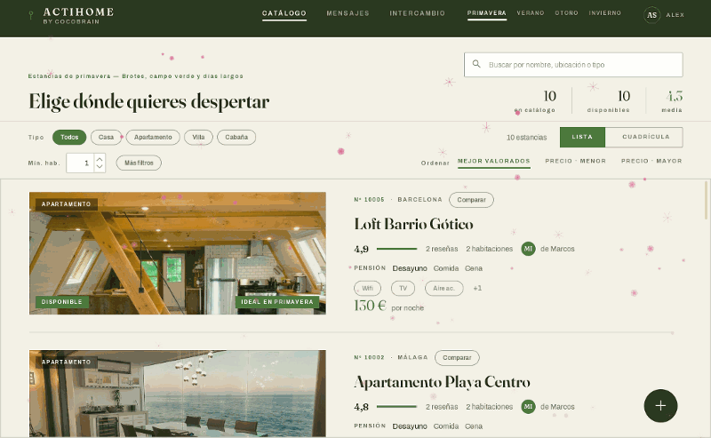
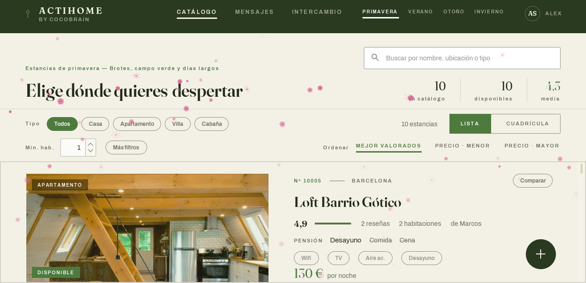
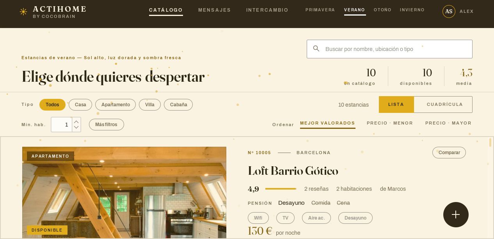
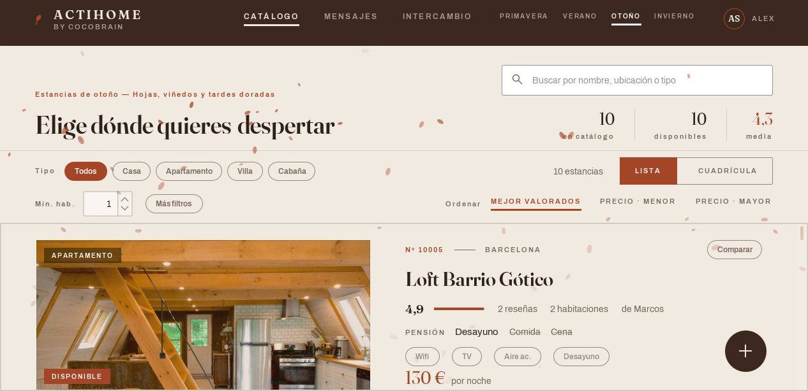
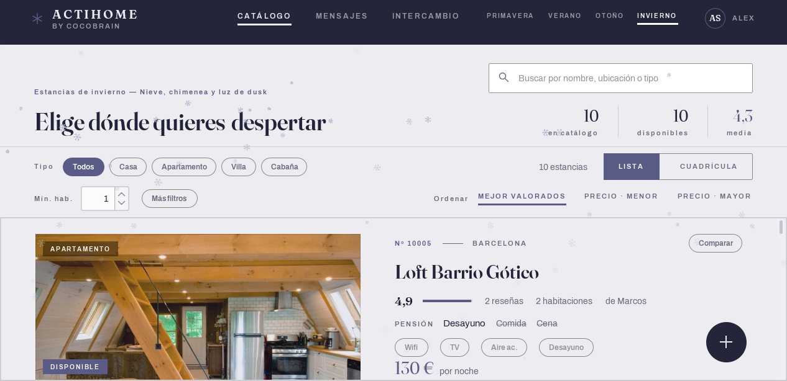
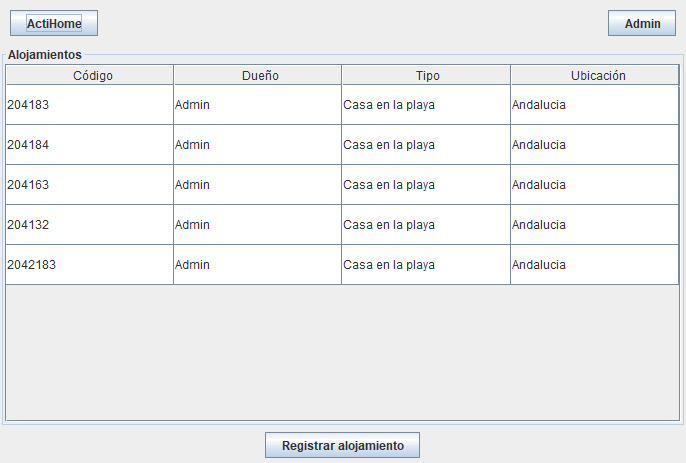
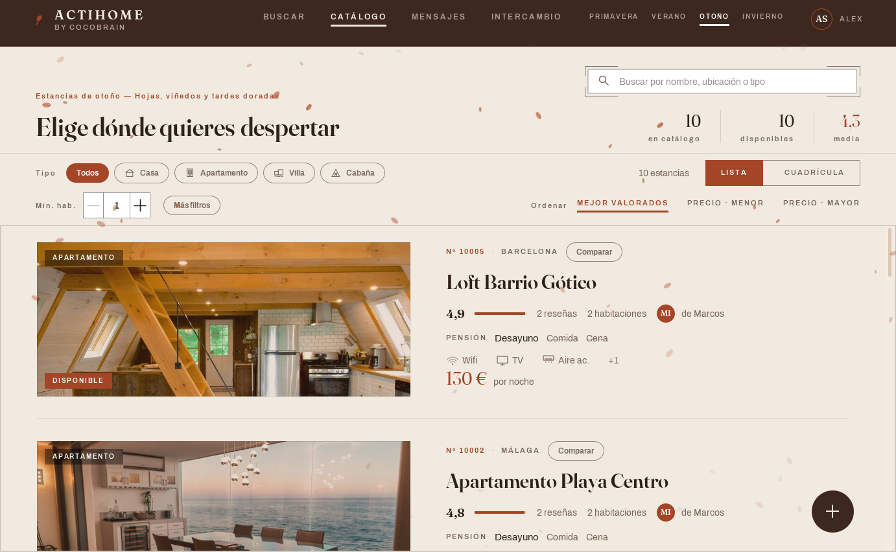

# ActiHome

[](https://github.com/alexsampeter93/actihome/actions/workflows/comprobaciones.yml)

Aplicación de escritorio para gestión, reserva e intercambio de alojamientos turísticos. **Java 17 · Spring Boot 3 · Swing · H2.**



La interfaz se repinta entera según la estación del año, que el usuario elige y la aplicación recuerda. No es un cambio de color: cada estación tiene su paleta de nueve tokens, su frase editorial, sus partículas animadas y su variante de la mascota.

Ninguna pantalla escribe un color. Pide un *papel* —"el acento", "el texto secundario"— y la estación activa decide cuál es, así que añadir una estación no toca ninguna de las dieciocho pantallas.

<p align="center">
  
  
  
  
</p>

<p align="center"><sub>Las cuatro, con detalle. El GIF se genera con <code>GenerarGif</code>: se pinta fuera de pantalla, no es una grabación.</sub></p>

---

## De dónde viene

Esto no empezó así. La aplicación existía, con toda su lógica de negocio, y su interfaz era la que Swing trae de serie: tablas, pares de etiqueta y valor, y ventanas de 500×500 escritas a mano.

| Antes | Después |
|---|---|
|  |  |

**→ [Galería completa antes / después](docs/ANTES-DESPUES.md)** — cuatro pantallas emparejadas, y lo que las capturas no enseñan.

Las de la izquierda no son una reconstrucción: salen de ejecutar el commit inicial recuperado del historial de Git.

---

## Arrancar

**Sin instalar nada.** La base de datos es H2 embebida en un fichero (`~/.actihome/`), así que no hay que montar ningún servidor.

```powershell
.\mvnw.cmd spring-boot:run     # arrancar
.\mvnw.cmd test                # 156 tests
.\empaquetar.ps1               # generar dist\ActiHome\ActiHome.exe
```

El ejecutable de `jpackage` incluye un runtime de Java recortado: **funciona en un Windows sin Java instalado**, con icono propio, sin consola y con conciencia de DPI.

Usuarios de ejemplo (contraseña `1234`): `Admin`, `Customer`, `Lucia`, `Marcos`, `Elena`. Los tres últimos son además propietarios de los alojamientos sembrados, así que entrar con ellos da acceso directo a editarlos e intercambiarlos.

---

## Qué hace

Dos roles (ADMIN / CUSTOMER) sobre 23 pantallas:

| | |
|---|---|
| **Catálogo** | Filtros por tipo, habitaciones, precio y ciudad · dos vistas · comparación de hasta 3 alojamientos lado a lado |
| **Reservas** | Disponibilidad calculada por fechas sobre las reservas activas, calendario interactivo, check-in con código, cancelación y pasarela de pago simulada |
| **Reseñas** | Cinco sub-notas por categoría, foto adjunta, respuesta pública del propietario y recálculo de la media del alojamiento |
| **Intercambio** | Permuta de alojamientos entre propietarios |
| **Mensajería** | Conversaciones huésped ↔ propietario por alojamiento |
| **Ubicación** | Previsión meteorológica de los próximos días y mapa del alojamiento, con las coordenadas resueltas desde el nombre del sitio. **Ningún servicio pide clave de API**, que es lo que permite que funcionen dentro del ejecutable repartido |
| **Paneles** | Ingresos y ocupación para el propietario; agregados globales para el administrador |
| **Sistema** | Español/inglés, cuatro estaciones, recordatorios en la bandeja del sistema y copia de seguridad de la base en caliente |

---

## Alcance: es monopuesto, y conviene decirlo antes de que se note

ActiHome modela un **mercado de dos lados** —propietarios que publican, huéspedes que reservan, mensajería entre ambos, intercambios— y se despliega como una **aplicación de escritorio con su base de datos en el disco del usuario** (`~/.actihome/actihome.mv.db`).

Las dos cosas juntas tienen una consecuencia que no se ve en una demo: **dos personas en dos ordenadores no comparten datos.** La mensajería huésped ↔ propietario funciona porque los dos usuarios viven en la misma base; para probarla, se cambia de sesión en la misma máquina.

**Es una decisión de alcance, no un defecto pendiente de arreglar.** Lo que la hace defendible es que el diseño no la da por buena para siempre:

- La **regla de dependencia** se cumple sin excepciones, así que la capa de servicio se puede mover tal cual a un backend sin tocarla. Lo único que se reescribiría es el trozo entre la interfaz y los servicios.
- El perfil `mysql` ya existe, aunque **compartir una base de datos entre clientes no es la salida buena**: obligaría a repartir credenciales de BD dentro del `.exe`, que es justo el problema que la recuperación de contraseña ya evita.

**Y el mismo límite explica una cosa del correo.** Las credenciales SMTP se leen de variables de entorno para que el ejecutable repartido *no lleve nada que robar* — un secreto dentro de un `.exe` se extrae descompilándolo. La consecuencia honesta es que, en una instalación normal, esas variables no están y **el envío por correo no se activa**: el camino que funciona es el código de recuperación que genera un administrador. Un secreto necesita un sitio donde vivir que no sea el ordenador del usuario, y ese sitio es un servidor que este proyecto, a día de hoy, no tiene.

---

## Arquitectura

Tres capas estrictamente unidireccionales, **sin una sola excepción en 172 ficheros**:

```
ui  →  services  →  DAOs  →  H2 / MySQL
```

Ningún servicio importa nada de `ui`. Eso es lo que permitió **rediseñar las 23 pantallas enteras sin tocar una línea de lógica de negocio**, y lo que abarataría partir la aplicación en cliente y servidor el día que hiciera falta.

- Las reglas de negocio viven solo en los servicios, con **29 excepciones propias** —una por regla— que la interfaz captura de una en una. No hay ningún `catch (Exception)` genérico en acciones de usuario.
- Las actualizaciones se apoyan en el *dirty checking* de JPA: `updateHousing` muta la entidad dentro de la transacción y **nunca llama a `save`**.
- Los servicios reciben objetos de datos con nombre, nunca listas de argumentos posicionales. Añadir un campo al modelo no cambia ninguna llamada existente — y evitó un fallo real que activaba desayuno, comida y cena al editar el precio.
- `schema.sql` y `data.sql` son **portables entre H2 y MySQL e idempotentes**: se ejecutan en cada arranque sin duplicar nada.

---

## Lo que hace distinto a este proyecto

Un catálogo de alojamientos lo tiene cualquiera. Lo que merece la pena mirar aquí es **cómo se verifica que la interfaz está bien**, porque no se hace a ojo.

### Herramientas de medición propias

Cuatro programas que recorren la aplicación. **Dos pueden fallar y dos no, y la diferencia importa:**

| Herramienta | Qué contesta | ¿Puede poner el build en rojo? |
|---|---|---|
| `MedirResponsive` | Coloca las 23 pantallas en 6 tamaños (1024×600 → 2560×1350) y recorre el árbol de componentes buscando lo que queda **fuera del área visible** | **Sí** |
| `MedirContraste` | Comprueba WCAG en las 4 estaciones: cada par de colores contra su mínimo real (4,5:1 para texto, 3:1 para componentes) | **Sí** |
| `MedirGlifos` | Qué símbolos sabe dibujar de verdad cada fuente empaquetada | No: informativa. Un símbolo ausente no es un fallo, es un aviso de que hay que dibujarlo a mano |
| `ScreenSnapshots` | Captura pantallas reales, con sesión iniciada por código y datos de verdad, fuera de pantalla y a cualquier tamaño | No: nada automático puede decir si una pantalla «se ve bien» |

Solo las dos primeras entran en el CI, y es deliberado: **un paso que nunca se pone en rojo no es una comprobación, es una decoración que da tranquilidad falsa.**

`MedirResponsive` encontró **107 componentes rotos que ninguna captura enseñaba**. Y trae algo que casi nadie escribe: un **autocontrol**. A un tamaño imposible (600×400) *tiene* que quejarse; si dijera «todo bien» también ahí, sabríamos que el detector no detecta y que su «sin recortes» no vale nada.

### Integración continua

Cada `push` a `main` y cada *pull request* ejecuta los **156 tests**, los recortes de layout en los seis tamaños y el contraste WCAG en las cuatro estaciones ([`comprobaciones.yml`](.github/workflows/comprobaciones.yml)).

Las dos herramientas de medición construyen ventanas de Swing de verdad, así que corren bajo `xvfb` — una pantalla virtual, porque un servidor no tiene escritorio donde dibujarlas.

### Una regla aprendida a base de romperla

> **Ningún tamaño que dependa de texto puede ser una constante.**

El escalado de Windows al 150 % no agranda la aplicación: **le entrega menos sitio**. Un portátil de 1920×1080 le da a Swing 1280×720 puntos lógicos, y ahí seis pantallas tenían botones dibujados *fuera* de la ventana — no cortados, inalcanzables. La aplicación resuelve esto con filas fluidas (que exigen el ancho de su hijo más ancho, no la suma), separaciones declaradas como rango `min:pref:max` y altos derivados de la métrica real de la fuente.

Se incumplió tres veces. La última, en la auditoría: 29 altos escritos a pelo repartidos por 20 ficheros que ninguna herramienta cazaba, porque `MedirResponsive` busca lo que cae *fuera* de la ventana y un texto rebanado *dentro* de su propia caja no cae fuera de nada. **Una comprobación automática solo protege de la clase de fallo que sabe buscar.**

### Tipografía

**Fraunces** (serif) y **Archivo** (sans), empaquetadas en el jar. Fraunces se incluye en **dos tallas ópticas** —variantes dibujadas para leerse pequeñas o en grande— y el sistema elige el archivo según el tamaño pedido: por debajo de 26px la de texto, por encima la de display. Quien llama sigue pidiendo «serif a 46» y no se entera.

Sustituyeron a Spectral y Manrope por una razón concreta: Manrope pertenece a la misma familia de grotescas geométricas que Inter y Space Grotesk, las que traen por defecto las plantillas de las que salen las interfaces generadas. Un sistema de diseño que se declara *anti-plantilla* y usa la tipografía canónica de esa estética se contradice en el elemento más visible que tiene.

### Auditoría técnica

[AUDITORIA.md](AUDITORIA.md) es un informe completo del estado del código: dependencias, deuda, concurrencia y código muerto, con lo corregido marcado y lo abierto valorado sin dramatizar — incluyendo por qué las CVE que arrastra H2 1.4.200 **no son explotables en esta aplicación** y por qué aun así hay que subir de versión.

---

## Stack

| Pieza | Versión | Papel |
|---|---|---|
| Java | 11 | |
| Spring Boot | 3.5.3 | Inyección de dependencias y Spring Data JPA. **No levanta servidor web** (`WebApplicationType.NONE`) |
| Swing + FlatLaf | 3.7.2 | Interfaz y Look & Feel base |
| MigLayout | 11.4.2 | Gestor de layout de todas las pantallas |
| H2 / MySQL 8 | | H2 embebida por defecto; MySQL disponible por perfil, con credenciales desde variables de entorno |
| JUnit 5 | | 156 tests, casi todos sobre la capa de servicio, en H2 en memoria |

---

## Créditos

Fotografías de [Unsplash](CREDITOS.md) · Fuentes **Fraunces** y **Archivo** bajo licencia SIL Open Font License · Mascota **Olaz** e identidad de **CocoBrain**, propias.
