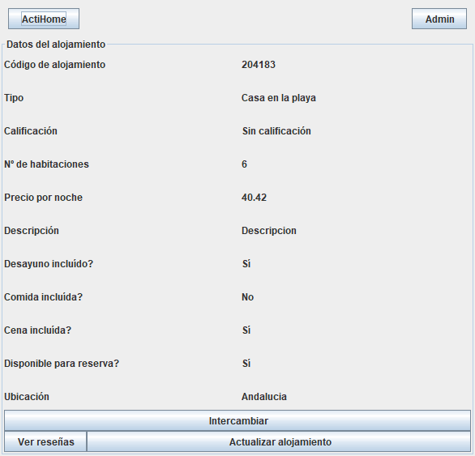
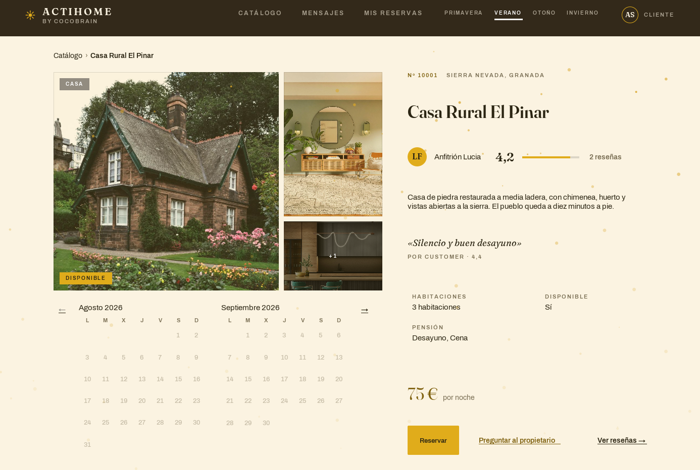
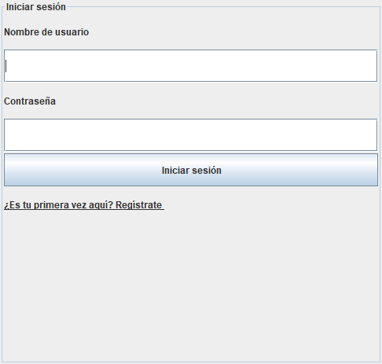
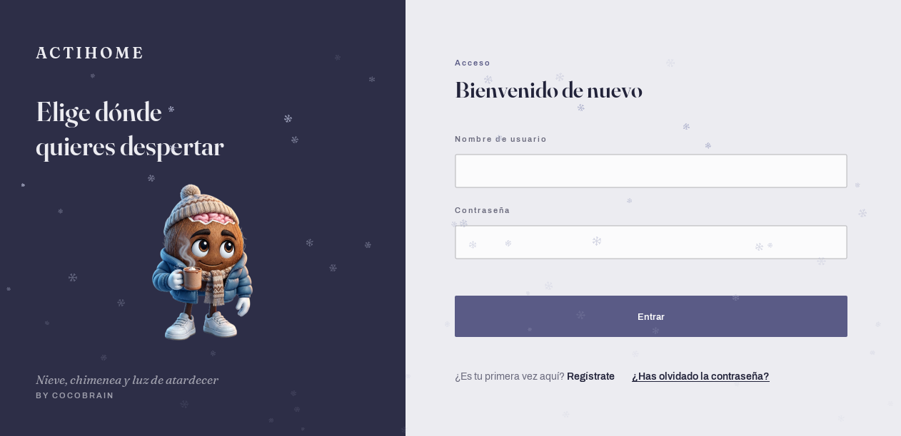
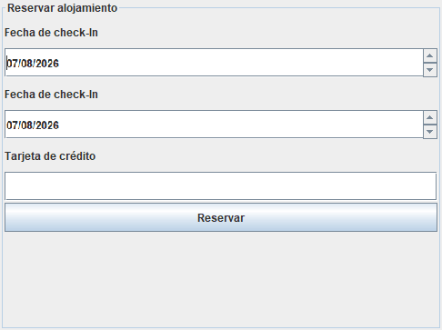
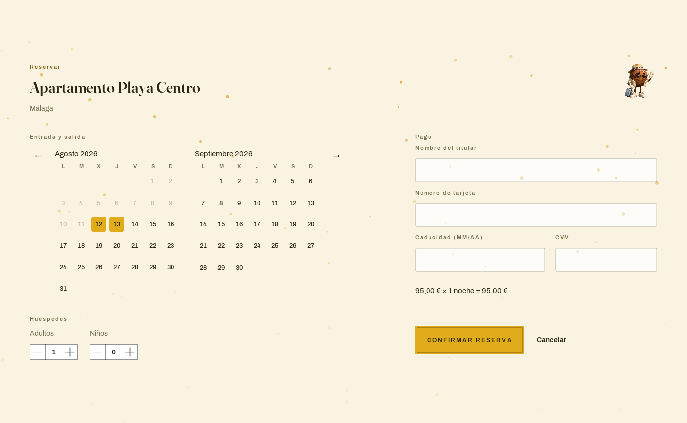

# ActiHome — antes y después

La misma aplicación, las mismas reglas de negocio, la misma base de datos.
Lo que cambia es todo lo que el usuario ve.

Las capturas de la izquierda **no son una reconstrucción**: salen de ejecutar el
commit inicial del proyecto, recuperado del historial de Git. Lo único que se
adaptó para poder arrancarlo fue la base de datos —H2 en memoria en lugar de
MySQL en `localhost`— porque el original traía las credenciales escritas en el
`application.yaml`. Ni una línea de interfaz se tocó.

---

## Catálogo

Es la pantalla principal, y la que más cambia.

| Antes | Después |
|---|---|
|  |  |

**Antes:** una `JTable`. Cinco filas que dicen *"Casa en la playa"* las cinco,
porque el modelo no tenía campo `name` y la ficha se titulaba con el tipo.

**Después:** fichas con foto, nombre comercial, nota, comodidades y precio.
Buscador, filtros por tipo, ciudad, precio y comodidades, dos vistas y un titular
que se contrae al bajar por la lista para devolverle el espacio al contenido.

---

## Detalle del alojamiento

| Antes | Después |
|---|---|
|  |  |

**Antes:** once pares de etiqueta y valor, uno debajo de otro. *"Descripción:
Descripcion"*.

**Después:** galería de fotos, anfitrión con avatar, cita de la mejor reseña,
previsión meteorológica real del sitio y mapa de ubicación. El precio y el botón
de reservar mandan en la columna derecha.

---

## Inicio de sesión

| Antes | Después |
|---|---|
|  |  |

**Después:** la ilustración cambia con la estación, igual que la paleta entera de
la aplicación.

---

## Reservar

| Antes | Después |
|---|---|
|  |  |

**Antes:** dos selectores de fecha, **los dos rotulados "Fecha de check-In"**.
No es un descuido de la captura: el segundo debía decir *check-Out*, y así estaba
en el código. Un campo mal etiquetado en la pantalla donde se paga.

**Después:** calendario de rango de dos meses que marca los días ya ocupados,
resumen del precio en vivo (`95,00 € × 1 noche`) y pago simulado con validación
de titular, número, caducidad y CVV.

---

## Lo que no se ve en las capturas

El rediseño no fue solo pintar. Por el camino salieron cosas que las imágenes no
cuentan:

- **La aplicación no era adaptable.** A 1280×660 —lo que le queda a un portátil
  de 1920×1080 con el escalado de Windows al 150 %— había **107 componentes
  dibujados fuera de la ventana**. No cortados: inalcanzables. Se detectaron con
  una herramienta escrita para eso, no mirando capturas.
- **El contraste no cumplía WCAG** en varios sitios, incluida la letra de las
  etiquetas secundarias en las cuatro estaciones. Nadie lo había medido nunca.
- **Los usuarios de ejemplo no podían iniciar sesión**: las contraseñas se
  sembraban en texto plano y el servicio las comparaba con BCrypt.
- **Doce bugs documentados**, entre ellos uno que activaba desayuno, comida y
  cena cada vez que alguien editaba el precio de un alojamiento, y otro que
  dejaba un alojamiento reservado bloqueado **para siempre**.

> **Una nota de honestidad sobre esta página:** falta el par de "Mis reservas",
> que también se capturó. Se ha dejado fuera porque en la versión original esa
> tabla sale **vacía** —el usuario de ejemplo no tenía reservas sembradas— y
> comparar una pantalla vacía con una llena no demuestra nada. La captura sigue
> en `progreso/antes-mis-reservas.png` para quien quiera verla.

Todo eso está contado, con su porqué, en el diario de desarrollo.

---

## Cómo se hicieron estas capturas

No son fotos de pantalla. Las genera una herramienta del proyecto que arranca la
aplicación, abre sesión por código y pinta cada ventana sobre una imagen en
memoria:

```powershell
.\mvnw.cmd compile exec:java "-Dexec.mainClass=fp.project.actihome.ui.dev.ScreenSnapshots" "-Dexec.args=fase3-catalogo ADMIN 1400x900"
```

Así son reproducibles y se pueden comparar entre versiones, que es justo lo que
esta página necesita.
